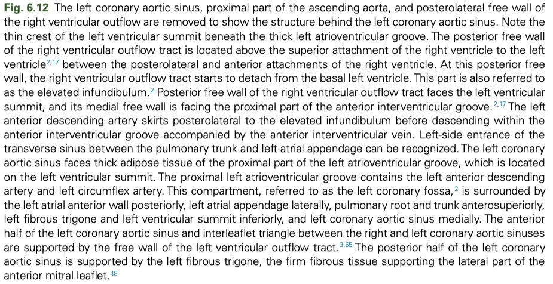
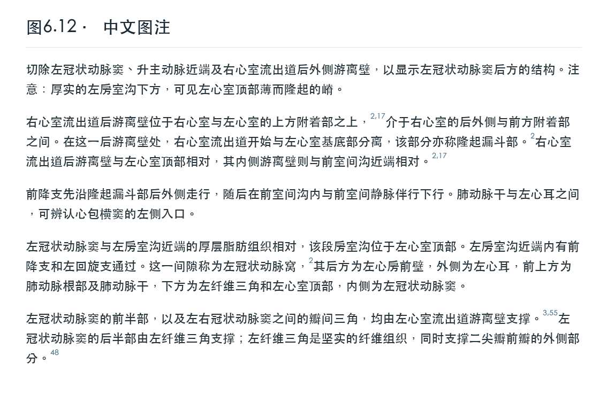

# 图6.12 · 心血管解剖图注中译

本例使用用户提供截图下方的完整英文图注，展示复杂解剖关系的中文教材化改写、A0 术语裁决及参考文献编号保留。

## 英文截图



## 中文定稿



## 完整文本与核对

- [完整英文转录](source.md)
- [完整中文译文](translation.md)
- [术语来源与裁决记录](terminology.md)

译文按观察方法、空间关系、血管走行、间隙边界和支撑关系分为自然段。参考文献标记 `2,17 → 2 → 2,17 → 2 → 3,55 → 48` 按原文顺序和对应位置保留；截图未提供的文献列表不另行补写。

“前降支”“左回旋支”“左纤维三角”“心包横窦”等采用匹配的 2025 A0 名词；未命中项按当前本机扩展术语库处理，来源详见术语表。《心血管病学名词（2025）》如实标注为征求意见稿。

## 推荐提示词

```text
使用 $translate-cardiovascular-literature-zh 翻译图6.12 下方的完整图注。
采用中国医学教材语体，先核对解剖语义链，再按 2025 A0 术语库定稿。
保留左右、前后、上下、内外、附着与支撑关系，以及全部参考文献编号。
按图注逻辑自然分段，只输出成熟中文译文。
```

同一截图的图片中文标注见配套仓库的 [medical-figure-zh 图谱示例](https://github.com/lcj-xiaoluobo/medical-figure-zh/tree/main/examples/fig-6-12)。
